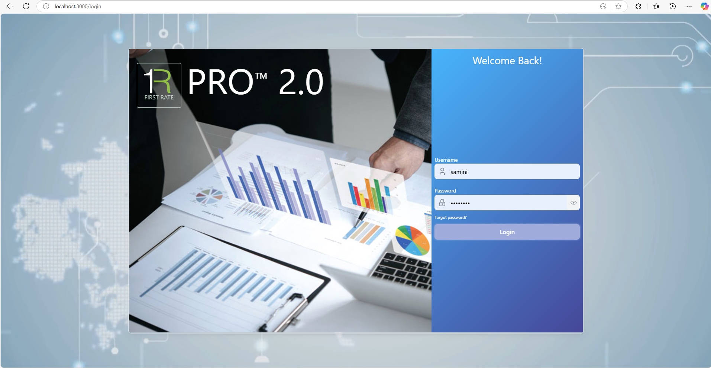
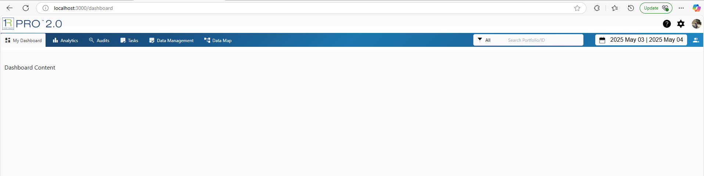
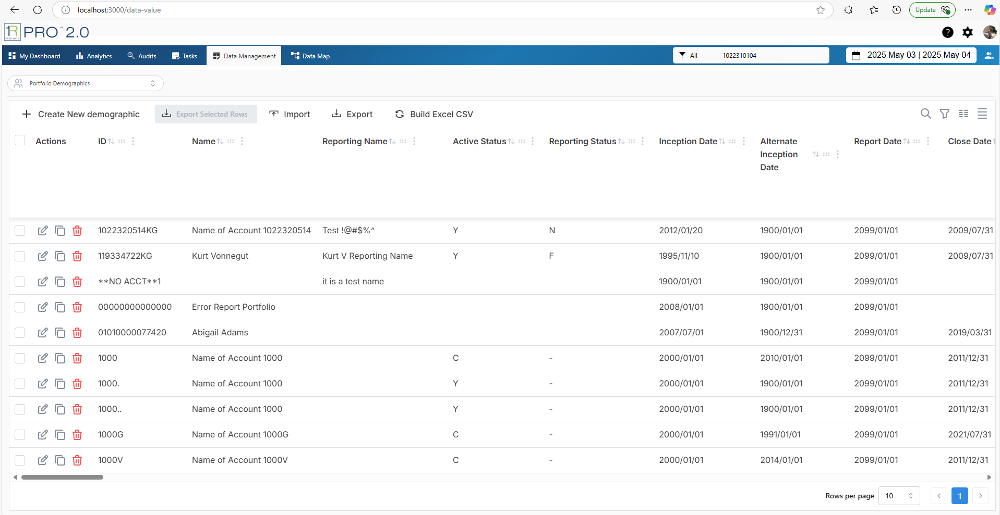
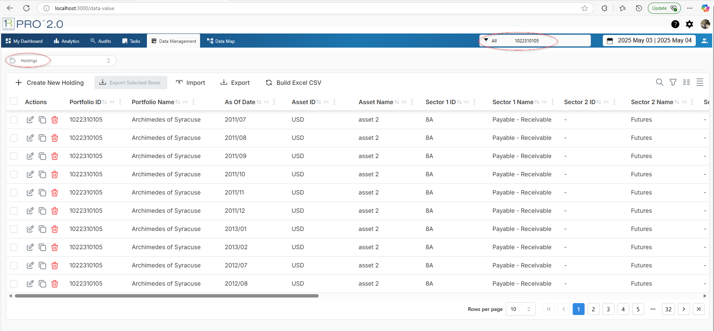
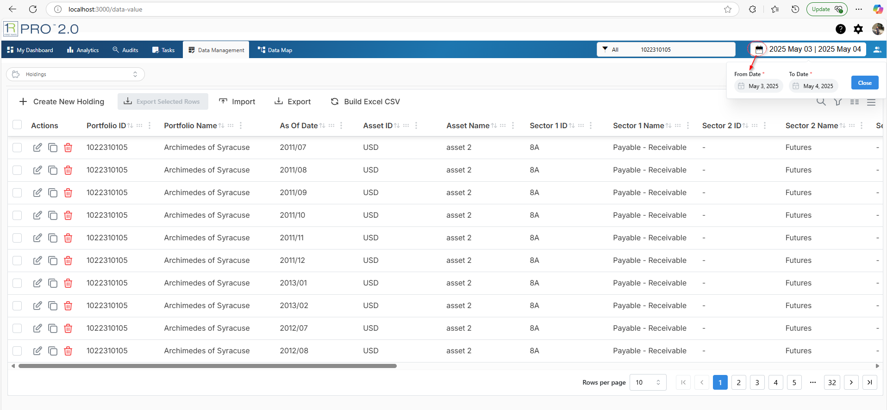
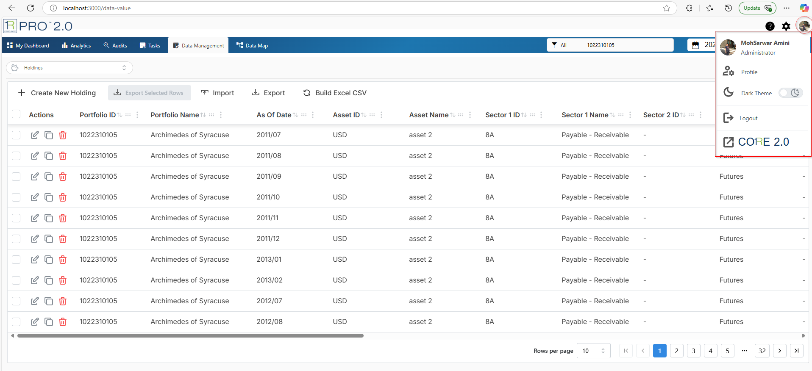
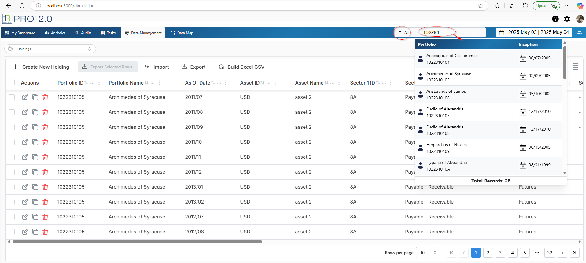
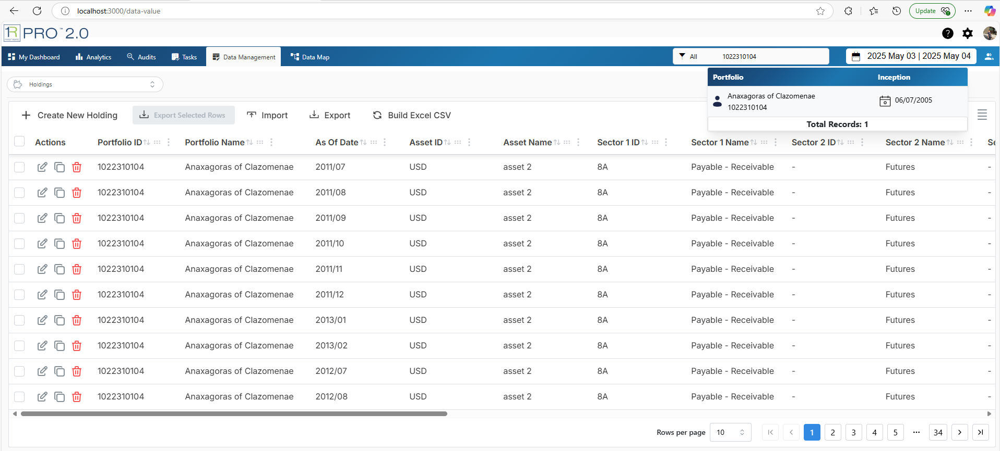
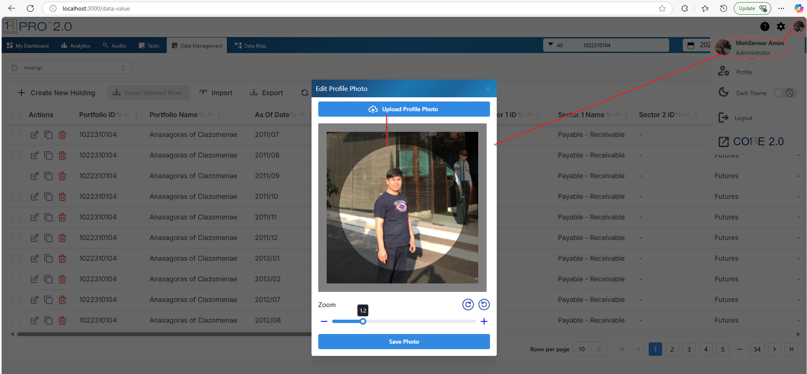

# Getting Started with Create React App
<h1>React App With Mantine React Table, for more detail about Mantine React Table, Click <a href="https://www.mantine-react-table.com/docs/examples/editing-crud">Mantine React Table</a></h1>
<h1>Installation of this application</h1>

<ol>
  <li>
    
Clone the repository:

     <code style="background-color: gray; color: lightcyan; font-weight: bold;">
       git clone https://github.com/FirstRate/professional.git  
       cd professional 
     </code>
  </li>
  <li>
    <h3>currently we tested this app with AFG local WebFOCUS server, because VPN blocking local node.js and React server to start, for this you can test on your desired region</h3>
    
To prepare to work with your desired region, please update the following files:

    <ul>
      <li><strong>.env: </strong> <i>change this file based on your desired region, like url, <b>REACT_APP_CLIENT,  REACT_APP_FRP_ROOT, REACT_APP_WEBFOCUS_IP</b></i>
      <li><strong>package.json: </strong> change the <b>"proxy": "https://afgpc82:8444"</b> to your desired url like <b>https://dev.firstrate.com</b></li>
      <li>React is using API and JSON data, Currently the FEX files are in CUST/PRO/DV2764 region, if you using diffrent region then copy the APIs from this folder</li>
    </ul>
  </li>
  <li>
   <h3> When your data is ready then go on testing Mantine React Table</h3>
   
Install dependencies:

   <code style="background-color: gray; color: lightcyan; font-weight: bold;">npm install</code>
  </li>
  <li>
   
Start React:

   <code style="background-color: gray; color: lightcyan; font-weight: bold;">npm run dev</code>
  </li>
  <li>
    
After 'npm run dev' command if there is no error, then you will see the following page:

    
  </li>
  <li>
    
Enter your credentials and click on login, you will see the dashboard like the following

    
  </li>
  <li>
    
Click <strong>Data Management</strong>, then you will see the following screen

    
  </li>
  <li>
    
From Dropdown Menu <strong>Select</strong> Holdings

    
  </li>
  <li>
    
Click on <strong> Calendar Icon</strong> to select the date range

    
  </li>
  <li>
    
Click on <strong> Profile Icon</strong> you will see the list of options

    
  </li>
  <li>
    
Search for Portfolio <strong> Select a filter for your portfolio search and enter a porfolio id/name then Enter/Click search icon</strong> you will see the following screen

    
  </li>
  <li>
    
Click on a portfolio <strong> Reload the screen for selected Portfolio</strong>

    
  </li>
  <li>
    
To upload a profile picture, click on <strong> Profile Avator > Click on [first name Last name]</strong> you will see the following page

    
  </li>
  
</ol>
